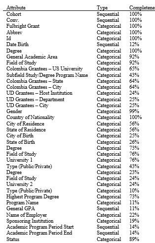

# Fulbright Foundation Scholarship Evolution

# Abstract
The interest of the Fulbright Foundation to analysis the data they already have is to evidence the evolution and improvement in the number and distrbution of the scholarships granted ever since its inception with the objective of identify which attributes are the most signifcant and through this way validate the current  strategie focused on reach more and better candidates and increase the effectiveness percentage of the applications. After the analysis of the requeriments, four different visualiations were proposed: Multilines Chart, Parallel Coordinates, Blox Plot and Radial Netword Diagram. The Multilines Chart would present the evolution of the scholarships, the Parallel Coordinates and Blox Plot charts are suitable to identify the significant attributes and the Ring Network Diagram allows us to find the relationships between Universities. In this way we expect to fill and cover the Fulbright Foundation needs of insights.

# What is show? (data abstraction)
Table with 4.002 records belonging to ex grantees of a Fulbright Foundation scholarship. Some attributes have been encrypted to allows its manipulation guarantying the accomplish all the confidentiality requirements of the foundation.

# Why is the user looking at it? (task abstraction)

* Present the evolution of the scholarships given by the Fulbright Foundation to Colombians since 1958 with the objective of evidence the different trends over the years

* Present/Compare the distribution of the educational and demographic aspects of the Fulbright Foundation scholarships grantees in order to demonstrate the diversity of the candidates over the years. 

* Identify the existing relationships between Colombians and Americans universities based on the number of scholarships granted by the Fulbright Foundation

# How is it show?

## Stacked Area Chart

### Marks

- Stacked areas. 
- Glyph: composite object, internal structure from multiple marks. 

### Channels

* MAGNITUDE
  * Horizontal position (ordered and separated years).
  * Vertical position: number of scholarships granted.
* IDENTITY
  * Tone for each one of the areas of study. 

## Parallel Coordinates

### Marks

- Vertical parallel lines as axis representing dimensions
- Point to represent each item (scholarship granted). 

### Channels

- MAGNITUDE
  - Vertical position to represent the number of FULBRIGHT foundation grantees.
  - Horizontal position that represents the value of the dimension. 
- IDENTITY
  -	Tone to identify the scholarship

## Ring Network Chart

### Marks

- Circles joint by an arrow

### Channels

- IDENTITY
  - Tonality for the different universities
- SELECT
  - Through the circles you can select a university

[Demo](https://www.youtube.com/watch?v=IWcW344DNPc)

[Papper](https://fulbright-colombia.github.io/va-exbecarios/doc/PoloA-MeraD-QuinteroC-Fulbright-Colombia.pdf)